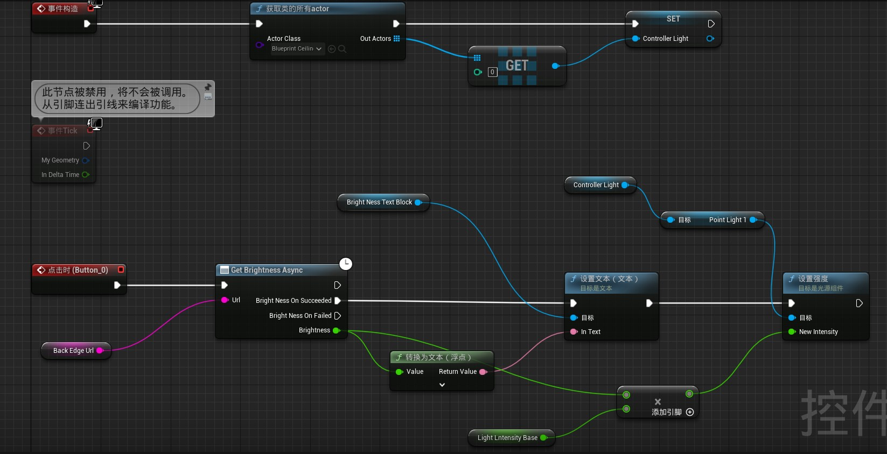

## 思路

在客户端发送GET请求，获取服务端预处理的灯光数据json，通过BluePrint同步至世界灯光

## 流程

1. 新建C++类GetBrightnessAsync类，基于UBlueprintAsyncActionBase
2. 在GetBrightness类中设置GET HTTP请求与后处理逻辑 并向蓝图暴露接口
3. 新建BPWidget用户UI 在事件图谱中新建请求逻辑
4. 将请求逻辑映射至场景灯光

## 代码

```cpp
// GetBrightnessAsync.h
// Fill out your copyright notice in the Description page of Project Settings.

#pragma once

#include "CoreMinimal.h"
#include "Kismet/BlueprintAsyncActionBase.h"
#include "Interfaces//IHttpRequest.h"
#include "GetBrightnessAsync.generated.h"

// 定义委托 返回亮度值
DECLARE_DYNAMIC_MULTICAST_DELEGATE_OneParam(FBrightnessDelegate,const float&,Brightness);

/**
 * 
 */
UCLASS()
class SCHOOL_API UGetBrightnessAsync : public UBlueprintAsyncActionBase
{
	GENERATED_BODY()
public:

	UGetBrightnessAsync();

	UFUNCTION(BlueprintCallable,Category="AsyncHttp",meta=(BlueprintInternalUseOnly="true"))
	static UGetBrightnessAsync* GetBrightnessAsync(const FString& Url);

	void HttpRequestStar(const FString& Url);
	void HttpRequest_PosRecHandle(FHttpRequestPtr Request,FHttpResponsePtr Response,bool bWasSuccess);
	
	// 委托以输出结果 
	UPROPERTY(BlueprintAssignable)
	FBrightnessDelegate BrightNessOnSucceeded;

	UPROPERTY(BlueprintAssignable)
	FBrightnessDelegate BrightNessOnFailed;
};

// GetBrightnessAsync.cpp
// Fill out your copyright notice in the Description page of Project Settings.


#include "GetBrightnessAsync.h"

#include <string>

#include "HttpModule.h"
#include "Interfaces/IHttpResponse.h"

UGetBrightnessAsync::UGetBrightnessAsync()
{
	if(HasAnyFlags(RF_ClassDefaultObject) == false)
	{
		AddToRoot(); // 防止自动GC
	}
}

UGetBrightnessAsync* UGetBrightnessAsync::GetBrightnessAsync(const FString& Url)
{
	UGetBrightnessAsync* BrightnessAsync = NewObject<UGetBrightnessAsync>();
	BrightnessAsync->HttpRequestStar(Url);
	return BrightnessAsync;
}

void UGetBrightnessAsync::HttpRequestStar(const FString& Url)
{
	TSharedPtr<IHttpRequest,ESPMode::ThreadSafe> Request = FHttpModule::Get().CreateRequest();
	Request->SetVerb("GET");
	Request->SetURL(Url);

	Request->OnProcessRequestComplete().BindUObject(this,&UGetBrightnessAsync::HttpRequest_PosRecHandle);
	Request->ProcessRequest();
}

void UGetBrightnessAsync::HttpRequest_PosRecHandle(FHttpRequestPtr Request, FHttpResponsePtr Response, bool bWasSuccess)
{
	if(bWasSuccess && Response.IsValid() && EHttpResponseCodes::IsOk(Response->GetResponseCode()))
	{
		TSharedPtr<FJsonObject> JsonObj;
		TSharedRef<TJsonReader<>> JsonReader = TJsonReaderFactory<>::Create(Response->GetContentAsString()); // 解析Json

		// 反序列化
		if(FJsonSerializer::Deserialize(JsonReader,JsonObj))
		{
			uint32 BrightNess;
			uint32 PicRows;
			uint32 PicCols;
			
			if(JsonObj->TryGetNumberField(TEXT("BrightNess"),BrightNess) && JsonObj->TryGetNumberField(TEXT("cols"),PicCols) && JsonObj->TryGetNumberField(TEXT("rows"),PicRows))
			{
				float BrightNessPower = BrightNess * 1.0 / (PicCols * PicRows);

				BrightNessOnSucceeded.Broadcast(BrightNessPower);
				RemoveFromRoot();
				return ;
			}
		}
	}

	BrightNessOnFailed.Broadcast({});
	RemoveFromRoot(); // 手动GC
}
```


```Golang
// 接受 Get
func handleGetBrightness(writer http.ResponseWriter,request *http.Request){
	
	jsonFile,err := os.Open(JsonFilePath + "/Output.json")
	
	if err != nil {
		fmt.Println(err)
		return 
	}

	defer jsonFile.Close()

	ByteValue,_ := ioutil.ReadAll(jsonFile)
	fmt.Println(string(ByteValue))

	writer.Header().Set("content-type","text/json")
	writer.Write(ByteValue)

}
```
## 蓝图

