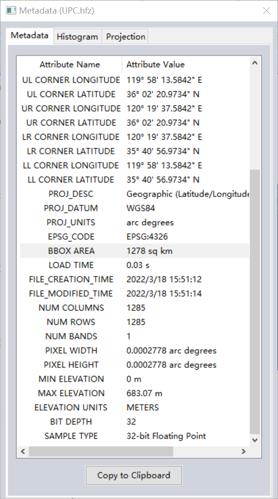

# 地形构建

1. 从地理空间数据云上获取相应的dem数据
2. 将dem数据导入Global Mapper中
3. 以HF2/HFZ导出数据，在导出Export Bounds选项中划定范围
4. 将HF2数据重新导入Global Mapper在Control Center中右键选择Metadata,记录BBOX AREA、MIN ELEVATION、MAX ELEVATION
   
   

5. 打开World Machine，在project settings中调整宽高，使得宽*高≈BBOX AREA
6. 