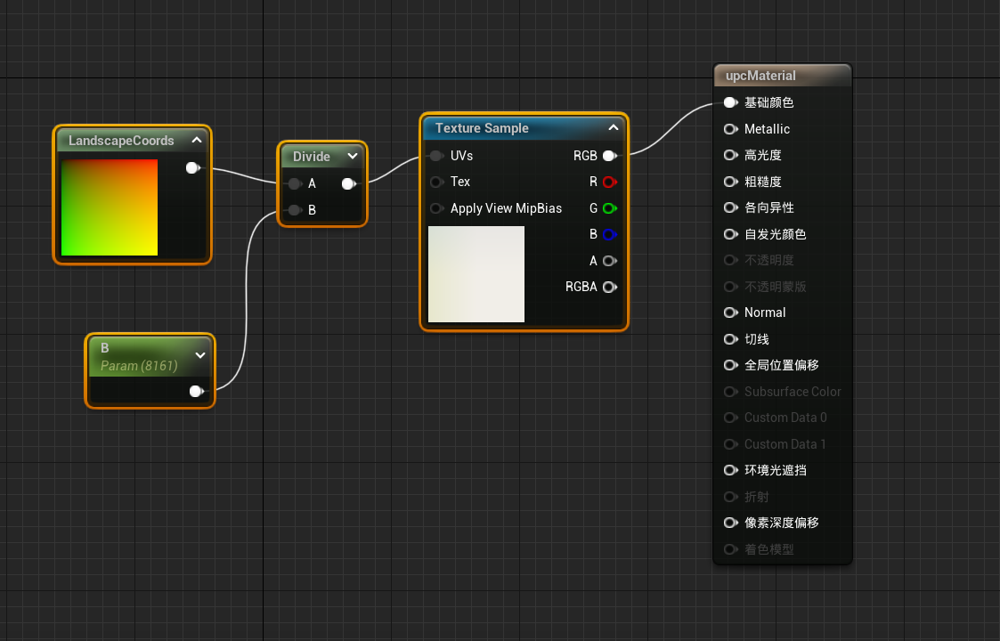
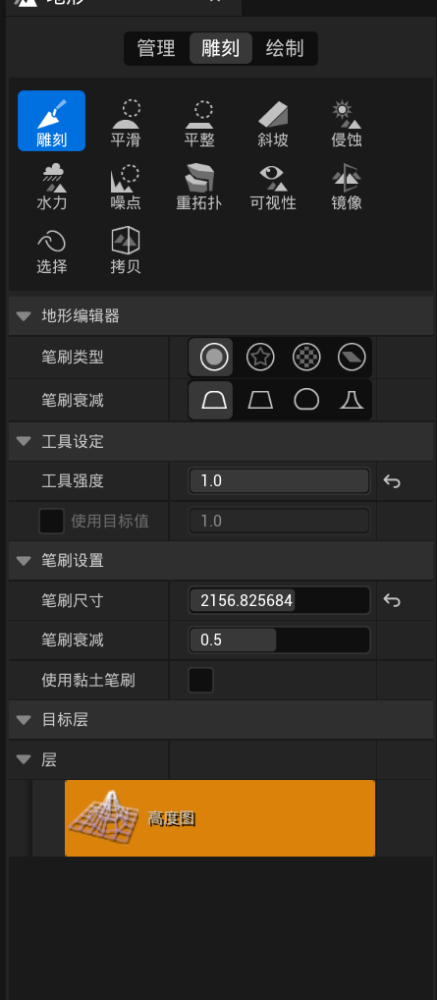
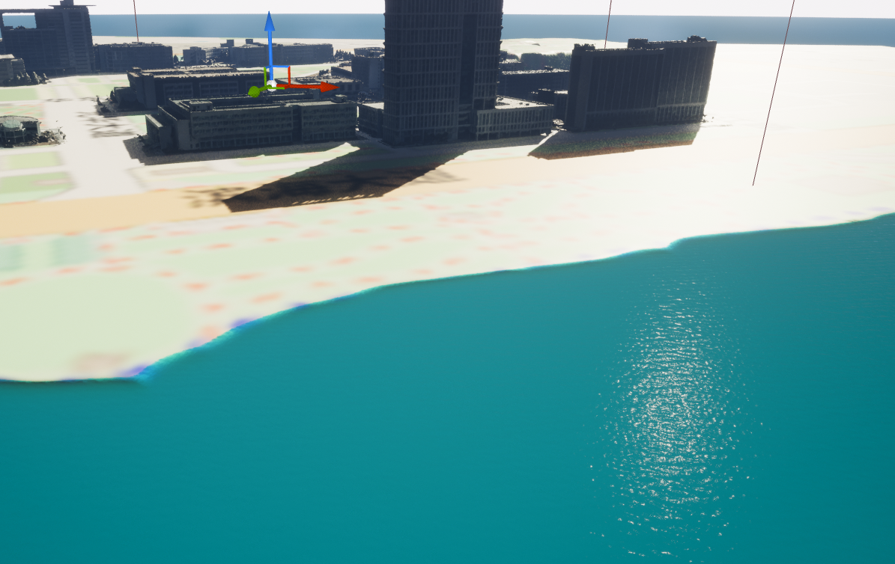

# 地形构建

可用方法：

1. DEM图通过world Machine转hfz高度图，并生产地形，置于UE中（适用于大范围，此项中效果较差）
2. 通过ceisum for unreal（插件版本不适应）

鉴于校园地形较平坦，且精度要求不高，所以采用手工构建的方式

## 流程

1. 获取目标地点的矢量地图，作为textrue，生成ue材质
   
   

2. 使用ue地形系统构建整体地形，将之前构建的材质作为地形材质，设置分段大小为255 × 255，组件分段为2 × 2，组件数量为32 × 32，整体分辨率为8129 × 8129
   
   

3. 使用地形的雕刻系统构建地形起伏，使用雕刻控制地形高度，平滑调整地形边缘，平整控制孔洞，斜坡创建平滑的斜面，使用侵蚀、水力与噪点创造粗糙的表面，以模拟真实地形

   

4. 打开ue water插件，使用水网格体，创建水面
   
   

5. 打开ue sunposition插件，模拟太阳位置构建
6. 将之前采集的建筑网格体，经过修整置入场景中，开启nantie选项，以优化高面数网格体性能
7. 使用植物模块，植入植物网格体（也可用于路灯的构建）